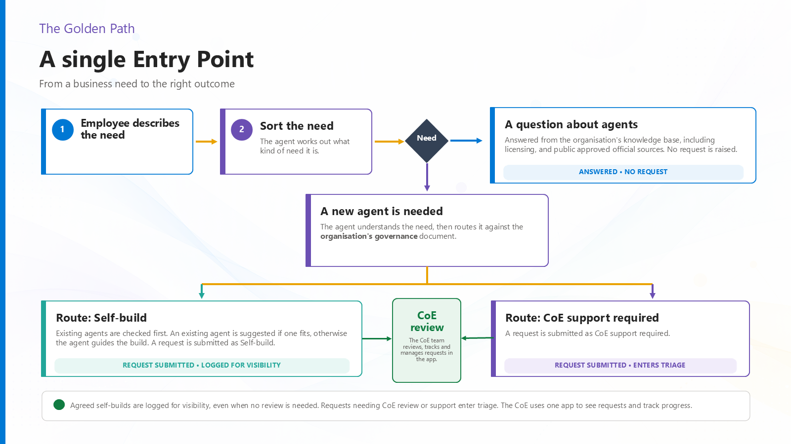

# Agent CoE Front Door — Power Platform inventory

This repository contains Agent CoE Front Door: a reusable Copilot Studio and Power Platform **agent intake and triage process** with optional technical discovery of Copilot Studio and Microsoft 365 Copilot Agent Builder resources through the Power Platform Inventory API.

It helps users:

- check the internal catalogue before requesting a new agent;
- discover tenant agents from a selected daily inventory source while keeping the catalogue curated;
- get licensing, governance, routing, and naming guidance from organization-owned knowledge;
- choose between reuse, guided self-build, and CoE-supported delivery;
- confirm collected intake details before any Dataverse write; and
- track catalogue and intake records in a model-driven triage app.

## Business value

The front door gives employees a single place to describe a business need without first choosing a technology or filling out a request form. Checking approved answers and the agent catalogue before intake can reduce duplicate builds and unnecessary CoE requests. Makers get an approved path to self-build when appropriate, while requests that need review arrive with clearer context and an explicit user confirmation. Catalogue and intake records give CoE reviewers a consistent view of demand.

These are intended benefits of the pattern, not measured savings or a promise that a particular deployment will achieve them.

## Golden path

The core pattern is **answer first, intake second**: describe the need, discover approved guidance and existing solutions, decide on a route, capture a confirmed request only when needed, and manage demand in the CoE app. The outcomes are reuse, guided self-build, or CoE-supported intake. A record is written only after the user confirms its details.

## Download

The current unmanaged solution source is version 1.0.0.2.

File:

`release/AgentCoEFrontDoor_1_0_0_2.zip`

SHA-256:

`5C97F04C01D8A437F82A297F8A7B64086BF3B3D83E3B17B6918B64AD7E2971C3`

## Included

- Copilot Studio agent with advisor and intake skills
- Agent Catalogue and Agent Intake Request Dataverse tables
- Tenant Agent Inventory table and a disabled daily Power Platform Inventory API flow, custom connector, and connection reference
- Dataverse MCP tool
- Model-driven triage app and generative dashboard
- Three organization-neutral knowledge templates in `knowledge/` (attach your approved versions before sharing the agent)
- Exploded solution source in `source/` for inspection
- Step-by-step deployment runbook, installation guidance, and installer checklist

> **Agent Catalogue vs Tenant Agent Inventory:** the **Agent Catalogue** is the curated, human-approved list the agent recommends to employees; **Tenant Agent Inventory** is a technical discovery cache populated by the optional daily flow (existence, not approval). The inventory flow discovers only Copilot Studio / Microsoft 365 Copilot Agent Builder agents — **not** custom-engine or pro-code agents (for example, Microsoft 365 Agents Toolkit / Agents SDK), nor other Power Platform resource types. See [Solution overview](docs/SOLUTION-OVERVIEW.md) and [Power Platform Inventory API](docs/POWER-PLATFORM-INVENTORY.md).

## Validation status

A non-production sandbox was used to validate the core pattern:

- solution import completed successfully;
- the agent, three tables, model-driven app, custom connector, connection reference, and disabled daily flow imported;
- the dashboard, catalogue, intake, inventory navigation, and the inventory views opened;
- the three knowledge templates reached Ready and retrieved independently with the expected scoped answers;
- the Front Door handled an empty target catalogue and inventory without exposing technical payloads;
- a complete TEST intake was summarized, then stopped on request; Dataverse remained at zero intake records before and after; and
- the published files were scanned for known credentials, secrets, tenant identifiers, source email addresses, and personal SharePoint URLs.

For the Power Platform Inventory API extension: in a fresh sandbox the delegated connector returned HTTP 200 and the daily flow succeeded twice, writing seven unique Copilot Studio inventory rows without duplicates. The flow was turned Off after testing. No Agent Builder records existed in that tenant, so that mapping remains untested with live data. The agent queried the refreshed inventory and catalogue through Dataverse and withheld an inventory-only draft from its reply.

On clean import, Copilot Studio can display empty parent instructions despite their presence in the package; restore them through the designer, save, reopen, and verify persistence. Imported connections require target-native binding. This maker-admin preview is **not** a non-admin security test: before employee rollout, configure least-privilege access and verify employee-facing behavior with a non-admin account.

Open validation gates are documented rather than hidden: the Power Platform Inventory API requires an authorized target app owner and administrator consent; approved knowledge must be attached before employee use; channel, evaluation, and non-admin security tests remain adopter-owned.

This package ships the three knowledge files as templates only: copy them from `knowledge/`, obtain local approval, attach them to the agent, and test retrieval before sharing it.

An earlier build of version 1.0.0.2 was imported into a fresh sandbox; the exact ZIP bytes in this release differ by targeted instruction and packaging edits and have not been re-imported as these exact bytes. Perform your own clean import and functional verification before relying on it.

Before importing, review:

- [Solution overview and diagrams](docs/SOLUTION-OVERVIEW.md)
- [Power Platform Inventory API setup and source mapping](docs/POWER-PLATFORM-INVENTORY.md)
- [User stories](docs/USER-STORIES.md)
- [Test prompts](docs/TEST-PROMPTS.md)
- [Installation and validation](docs/INSTALLATION.md)
- [Step-by-step deployment runbook](docs/DEPLOYMENT-RUNBOOK.md)
- [Installer checklist](docs/INSTALLER-CHECKLIST.md)

## Important disclaimer

This repository is a reusable reference template provided **as is**. It is not an official Microsoft product, endorsed reference architecture, certification, or support commitment.

The validation described above is non-production testing, not a guarantee that the solution is secure, compliant, licensed, suitable, or operationally ready for another organization. Adopters are responsible for their own review, configuration, testing, licensing, capacity, security, privacy, DLP, accessibility, support, and change management.

Do not use example placeholders as approved policy. Do not add credentials, tokens, customer data, internal documents, private links, or production records to this repository.

See [NOTICE.md](NOTICE.md) for the full disclaimer and [LICENSE](LICENSE) for licensing terms.

## Compatibility identifiers

The exported solution retains the existing `cat_` Dataverse schema prefix and related internal component identifiers for upgrade compatibility. They are technical identifiers, not adopting-organization branding. Renaming them would require rebuilding the solution and break upgrades from the current package lineage.
