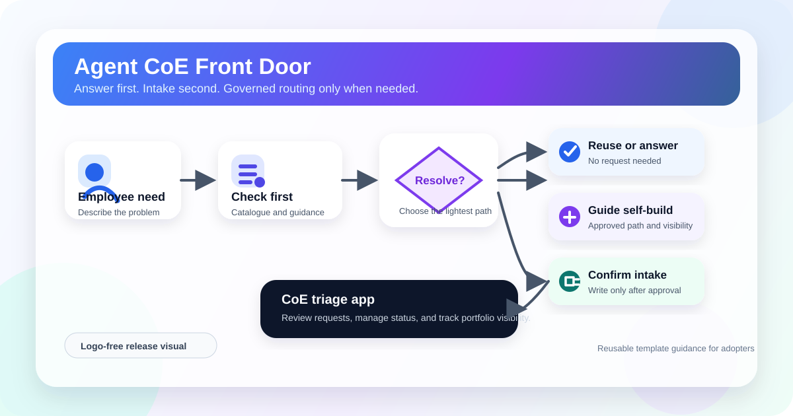
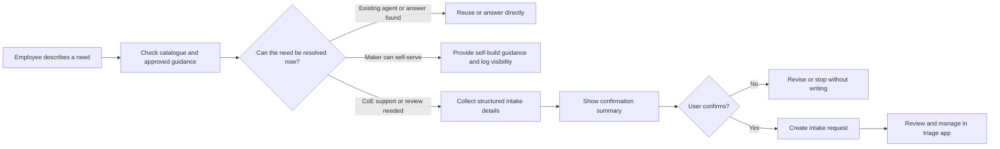

# Agent CoE Front Door

Agent CoE Front Door is a reusable Copilot Studio and Power Platform **agent intake and triage process** for organizations that need a governed entry point for agent discovery, guidance, and delivery support.

It helps users:

- check the internal catalogue before requesting a new agent;
- get licensing, governance, routing, and naming guidance from organization-owned knowledge;
- choose between reuse, guided self-build, and CoE-supported delivery;
- confirm collected intake details before any Dataverse write; and
- track catalogue and intake records in a model-driven triage app.

## Golden path

The core pattern is **answer first, intake second**. A request is created only when the organization needs visibility, review, or CoE-supported delivery.

## Download

The clean-room-tested unmanaged solution is available from the [v1.0.0.1 release](https://github.com/SandraBcna/agent-coe-front-door-release/releases/tag/v1.0.0.1).

File:

`AgentCoEFrontDoor_1_0_0_1.zip`

SHA-256:

`08A63739B3B7518877F313C05C01701FAB6F0B7E8D90CFFF03334A8D551ECFF0`

## Included

- Copilot Studio agent with advisor and intake skills
- Agent Catalogue and Agent Intake Request Dataverse tables
- Dataverse MCP and configurable Microsoft Teams tools
- Model-driven triage app and generative dashboard
- Three organization-neutral knowledge templates
- Exploded solution source for inspection
- Step-by-step deployment runbook, installation guidance, and installer checklist

## Validation status

Version 1.0.0.1 was imported into a newly provisioned developer environment with Dataverse and exercised through a clean golden path:

- solution import completed successfully;
- KB-01, KB-02, and KB-03 retrieved independently;
- target-native Dataverse MCP catalogue and create operations worked;
- reuse and licensing scenarios passed;
- intake required explicit confirmation before creating and reading back `REQ-0001`;
- the model-driven app dashboard, navigation, views, forms, and filters worked; and
- the published files were scanned for known credentials, secrets, tenant identifiers, source email addresses, and personal SharePoint URLs.

Before importing, review:

- [Solution overview and diagrams](docs/SOLUTION-OVERVIEW.md)
- [User stories](docs/USER-STORIES.md)
- [Test prompts](docs/TEST-PROMPTS.md)
- [Installation and validation](docs/INSTALLATION.md)
- [Step-by-step deployment runbook](docs/DEPLOYMENT-RUNBOOK.md)
- [Installer checklist](docs/INSTALLER-CHECKLIST.md)

## Important disclaimer

This repository is a reusable reference template provided **as is**. It is not an official Microsoft product, endorsed reference architecture, certification, or support commitment.

The validation described above is non-production testing, not a guarantee that the solution is secure, compliant, licensed, suitable, or operationally ready for another organization. Adopters are responsible for their own review, configuration, testing, licensing, capacity, security, privacy, DLP, accessibility, support, and change management.

Do not use example placeholders as approved policy. Do not add credentials, tokens, customer data, internal documents, private links, or production records to this repository.

See [NOTICE.md](NOTICE.md) for the full disclaimer and [LICENSE](LICENSE) for licensing terms.

## Gallery submission

The same solution is under review for the Microsoft Copilot Studio Gallery:

https://github.com/microsoft/copilot-studio-gallery/pull/27
