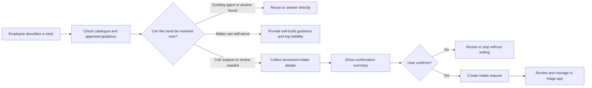
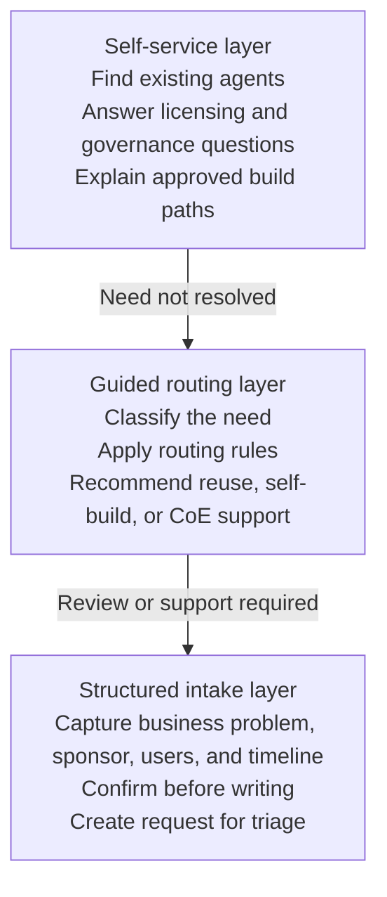
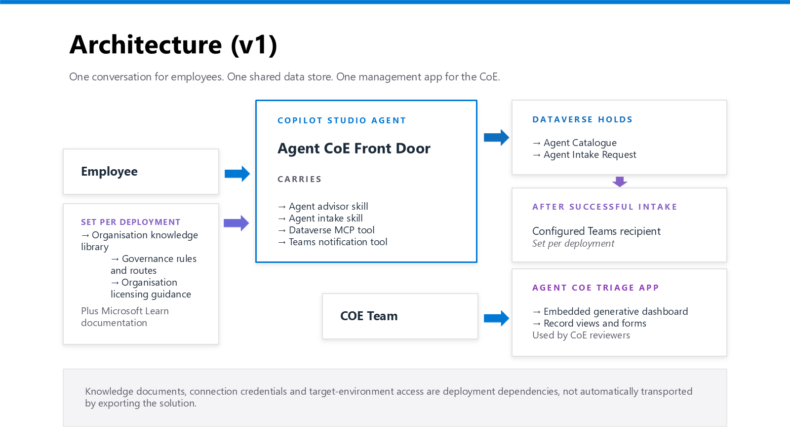

# Solution overview

Agent CoE Front Door is a reusable intake and triage pattern for organizations that want a governed entry point for agent discovery, guidance, self-build routing, and CoE-supported delivery.

The design principle is **answer first, intake second**. The agent should avoid creating a request when it can answer from approved knowledge, point to an existing catalogue item, or guide a maker through an approved self-service path.

## Golden path

## Operating model

Each layer should run only when the previous layer cannot resolve the request. This keeps the front door lightweight for employees while still giving the CoE visibility into demand that needs review or delivery support.

## Package boundary

```mermaid
flowchart LR
    subgraph Package[Included in this release]
        A[Front Door agent]
        B[Advisor and intake skills]
        C[Agent Catalogue table]
        D[Agent Intake Request table]
        E[Triage model-driven app]
        F[Knowledge templates]
        G[Dataverse MCP and Teams tool definitions]
    end

    subgraph Target[Configured by the adopting organization]
        H[Approved knowledge content]
        I[Connections and identities]
        J[Security roles and access]
        K[Teams destination]
        L[Catalogue seed records]
        M[Operational owners and review cadence]
    end

    Package --> Target
```

Knowledge files, credentials, permissions, connection identities, Teams recipients, catalogue records, and production operations do not automatically travel with the solution package. The adopting organization must configure, approve, and test those values in its own environment.

## Main outcomes

| Outcome | Description |
|---|---|
| Reuse | The user is directed to an existing agent or approved answer where possible. |
| Guided self-build | A maker receives approved guidance and next steps without forcing a CoE delivery request. |
| CoE-supported intake | A structured request is created only after the user confirms the summary. |
| Portfolio visibility | CoE reviewers manage catalogue and intake records in the triage app. |
